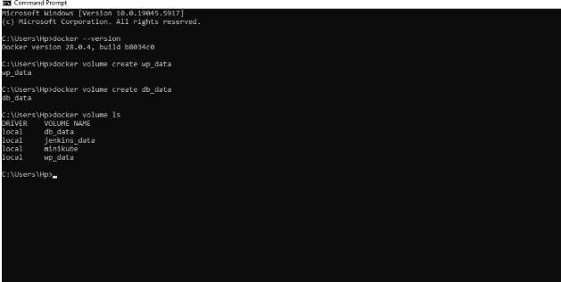
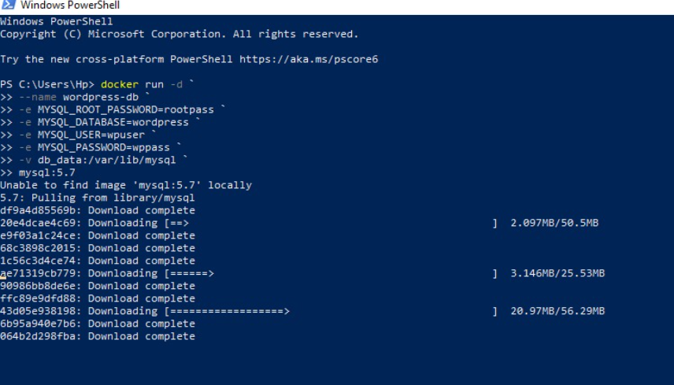
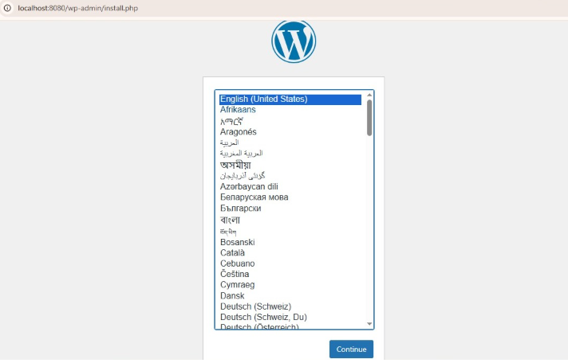
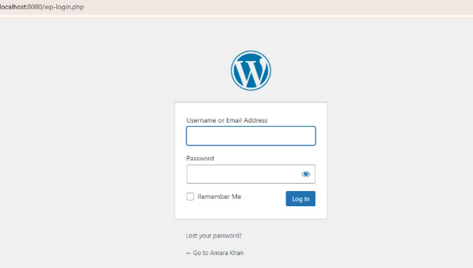
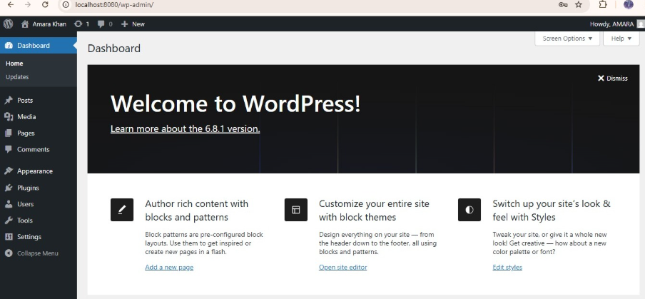
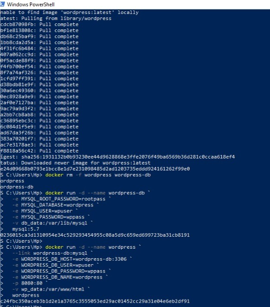
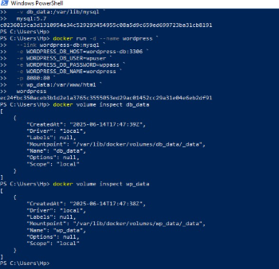

# 🐳 Containerized WordPress with MySQL (Docker + Volumes)

A practical DevOps project demonstrating the containerization of a WordPress site with a MySQL backend using Docker and Docker Compose. This project highlights persistent data storage using Docker volumes and ensures full recovery of the application even after containers are destroyed.

---

## 📌 Objectives

* Deploy a WordPress website using Docker containers
* Use Docker volumes to persist both application and database data
* Verify data persistence by removing and recreating the containers
* Understand container orchestration basics with Docker Compose

---

## 🧱 Tech Stack

* **WordPress** (official image)
* **MySQL 5.7** (official image)
* **Docker**
* **Docker Volumes**
* **Docker Compose**
* **PowerShell / CLI**
* **Screenshots for verification**

---

## 📂 Folder Structure

```
containerized-wordpress-with-mysql/
├── docker-compose.yml
├── README.md
├── screenshots/
│   ├── 0_docker_volume_check_before_start.PNG
│   ├── 1_mysql_image_pull_and_run.png
│   ├── 2_wordpress_container_setup.png
│   ├── 3_wordpress_setup_wizard.png
│   ├── 4_wordpress_login.PNG
│   ├── 5_wordpress_home_or_dashboard.png
│   ├── 6_persistence_test_container_recreation.PNG
│   ├── 7_containers_running_after_recreation.PNG
│   ├── 7_volume_inspection_and_final_persistence_check.png
│   ├── 8_wordpress_image_repull_container_restart.png
│   ├── 9_blog_post_live.png
```

---

## 🚀 Step-by-Step Setup Guide with Screenshots

### ✅ Step 1: Check Existing Docker Volumes

Before starting, we inspect existing Docker volumes.

📸 

---

### ✅ Step 2: Launch MySQL Container

Run the following command to start the MySQL container:

```bash
docker run -d \
  --name wordpress-db \
  -e MYSQL_ROOT_PASSWORD=rootpass \
  -e MYSQL_DATABASE=wordpress \
  -e MYSQL_USER=wpuser \
  -e MYSQL_PASSWORD=wppass \
  -v db_data:/var/lib/mysql \
  mysql:5.7
```

📸 

---

### ✅ Step 3: Launch WordPress Container

Run the following command:

```bash
docker run -d \
  --name wordpress \
  --link wordpress-db:mysql \
  -e WORDPRESS_DB_HOST=wordpress-db:3306 \
  -e WORDPRESS_DB_USER=wpuser \
  -e WORDPRESS_DB_PASSWORD=wppass \
  -e WORDPRESS_DB_NAME=wordpress \
  -p 8080:80 \
  -v wp_data:/var/www/html \
  wordpress
```

📸 

---

### ✅ Step 4: Open WordPress in Browser

Visit: [http://localhost:8080](http://localhost:8080)

📸 

---

### ✅ Step 5: Log in to WordPress Dashboard

After setup, log in using your credentials.

📸 
📸 

---

### ✅ Step 6: Add Sample Blog Post

Create a blog post to test data persistence.

📸 

---

### ✅ Step 7: Simulate Failure by Removing Containers

```bash
docker rm -f wordpress wordpress-db
```

Then recreate using the same commands or `docker-compose up -d`.

📸 
📸 

---

### ✅ Step 8: Verify Data Persistence

Use volume inspection:

```bash
docker volume inspect db_data

docker volume inspect wp_data
```

📸 

✅ You’ll notice all previous content remains intact.

---

## 🧠 Key Concepts Demonstrated

* Containerized full-stack web application
* Use of Docker named volumes for data persistence
* Multi-container orchestration via Docker Compose
* Recoverable, stateful container environments

---

## 📍 About Me

Hi! I’m **Amara Khan**, a Computer Science student and Data Analyst enthusiast. I’m passionate about DevOps, cloud technologies, and building real-world tech projects.
Follow my learning journey at [@archivedbyammara](https://instagram.com/archivedbyammara) 📚🚀

---

## 📜 License

This project is open-source and available under the [MIT License](LICENSE).

---

## ⭐️ Connect with Me

* [LinkedIn](https://www.linkedin.com/in/amara-khan-pro/)
* [Instagram](https://instagram.com/archivedbyammara)
* [GitHub](https://github.com/being-amara-khan)
